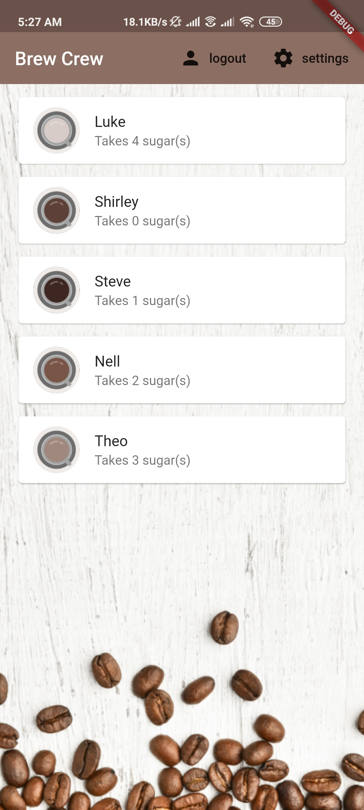
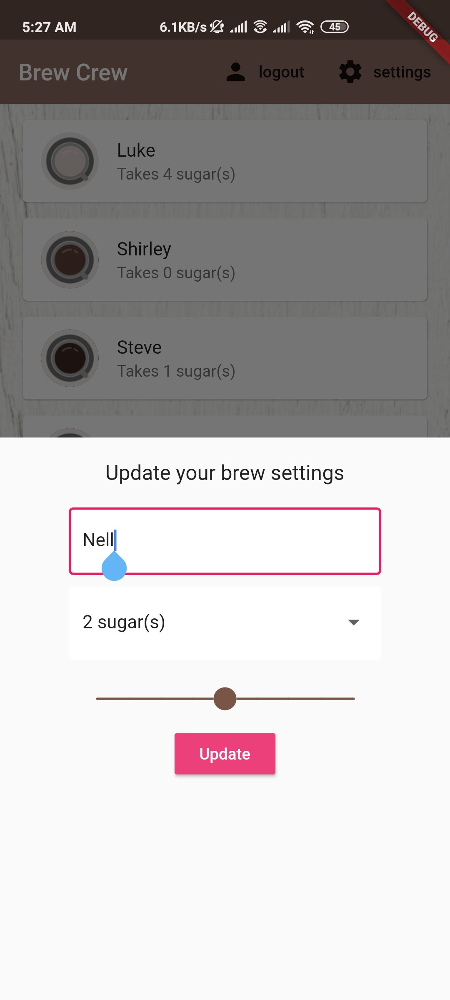

# Brew Crew

Brew Crew is a flutter application which allows a group of people to select their brew preferences like the amount of sugar and the strength.

The app uses firebase_auth to register and sign in users with email and password.
The app uses cloud_firestore as a realtime database to store user data (i.e. brew preferences) in a collection called brews.

The app has a total of three screens including a sign up screen, a sign in screen and a home screen with bottom sheet.

The home page shows a list of brew preferences for all the users registered with the app.

When a user registers with the app a new document is created in the collection with some dummy data and the user is directed to the home page which shows a list of brew preferences for all the users registered with the app. The user can update his/her preferences by pressing the settings button in the top right corner, popping up a settings panel in the form of a bottom sheet where he can change various settings. Once he clicks on update the data updates in real time.

cloud_firestore BrewCrew database: https://console.firebase.google.com/u/0/project/brewcrew-3a6dd/database/firestore/data~2Fbrews~2F3E5TSJlyYsXqyGoJXRYDgAiNVa13

firebase_auth registered users: https://console.firebase.google.com/u/0/project/brewcrew-3a6dd/authentication/users

## Screenshots
<table>
  <tr>
    <th>Sign Up Page</th>
    <th>Sign In Page</th>
    <th>Home Page</th>
    <th>Settings Panel</th>
  </tr>
  <tr>
    <td></td>
    <td></td>
    <td></td>
    <td></td>
  </tr>
</table>
